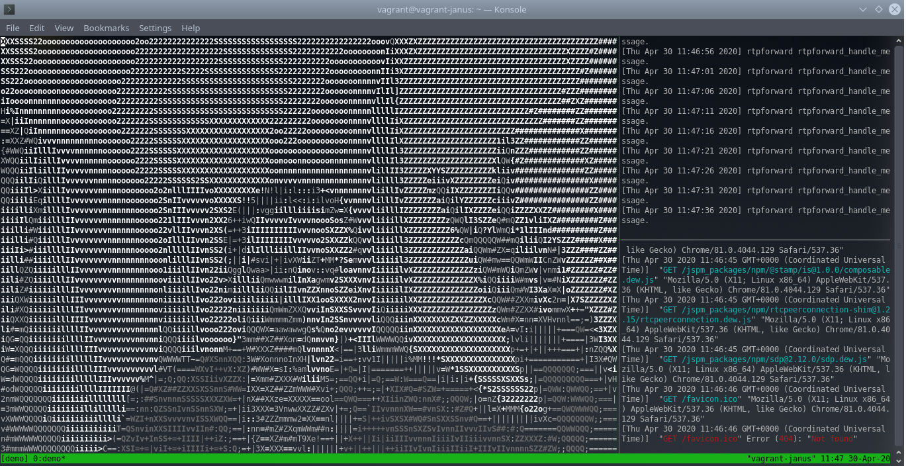

# vagrant_janus-rtpforward-plugin_demo

A provisioned virtual machine demonstrating [janus-rtpforward-plugin](https://github.com/michaelfranzl/janus-rtpforward-plugin).

Running `janus-rtpforward-plugin` version 0.9.2 against `janus-gateway` version 0.9.2.

## Usage

1. Make sure that no services are listening on `localhost` of your host OS on ports 8188 (`janus-gateway` websocket) and 8080 (demo HTTP server).
2. Install Vagrant in your host OS.
3. Run in the host OS:

```sh
cd vagrant_janus-rtpforward-plugin_demo
vagrant up
vagrant ssh -c 'cd /vagrant; tmuxinator --local'
```

This will run the following processes inside the virtual machine:

* `janus-gateway` server with `janus-rtpforward-plugin` loaded
* `http-server` serving the files of the [janus-rtpforward-plugin demo](https://github.com/michaelfranzl/janus-rtpforward-plugin/tree/master/demo)
* A GStreamer pipeline receiving the RTP video stream forwarded by `janus-rtpforward-plugin` and displaying it as ASCII art directly in the terminal.

The video is originating from the web camera attached to your browser running in the host OS. Using a modern browser in your host OS:

1. Go to http://localhost:8080
2. Allow access to your media devices
3. Observe the video in the terminal (see screenshot).


